### Inicio

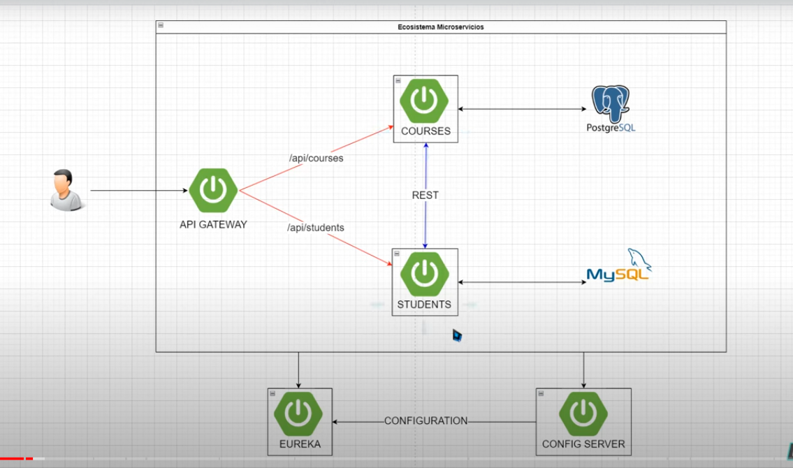
## Iniciar Proyecto Padre

### 1. Crear carpeta contenedora

### 2. Ir a Maven en el navegador y buscar "Maven in 5 minutes"

URL: [Maven in 5 minutes](https://maven.apache.org/guides/getting-started/maven-in-five-minutes.html)

### 3. Copiar el código inicializador del proyecto

```bash
mvn archetype:generate -DgroupId=com.mycompany.app -DartifactId=my-app -DarchetypeArtifactId=maven-archetype-quickstart -DarchetypeVersion=1.4 -DinteractiveMode=false
```

### 4. Ejecutar el comando en la consola

Ubícarce en la carpeta contenedora del proyecto, pegar y modificar el comando si es necesario:

```sh
-DarchetypeArtifactId=maven-archetype => nombreArtifact
```

### 5. Una vez creado el proyecto desde el IDE

- Eliminar toda la carpeta `src`
- Modificar el archivo `pom.xml`:

    - Eliminar la siguiente línea:

  ```xml
  <!-- FIXME change it to the project's website -->
  <url>http://www.example.com</url>
  ```

    - Eliminar toda la sección `dependencies` y lo que contiene la etiqueta `build`.

### 6. Modificar el archivo `pom.xml`

- Cambiar la versión de Java a 17.
  - Agregar lo siguiente en la sección `build`:

```xml
<build>
    <pluginManagement>
        <plugins>
            <plugin>
                <groupId>org.springframework.boot</groupId>
                <artifactId>spring-boot-maven-plugin</artifactId>
                <version>3.2.5</version>
            </plugin>
        </plugins>
    </pluginManagement>
</build>
```
- Agregar lo siguiente en la sección `dependencies`:

```xml
<dependencies>
    <dependency>
        <groupId>org.projectlombok</groupId>
        <artifactId>lombok</artifactId>
        <version>1.18.28</version>
    </dependency>
</dependencies>
```
- Debajo de la etiqueta `<name>my-app</name>`, agregar lo siguiente para especificar que este proyecto será un proyecto Padre:

```sh
  <packaging>pom</packaging>
```
- Para terminar de especificar que este `pom.xml` será el contenedor de los subproyectos, agrega lo siguiente debajo de la etiqueta `modelVersion` y encima de la etiqueta `groupId`:

  ```xml
  <parent>
      <groupId>org.springframework.boot</groupId>
      <artifactId>spring-boot-starter-parent</artifactId>
      <version>3.3.0</version>
  </parent>
  ```

### Versión 01 del `pom.xml` general

```sh
<?xml version="1.0" encoding="UTF-8"?>

<project xmlns="http://maven.apache.org/POM/4.0.0" xmlns:xsi="http://www.w3.org/2001/XMLSchema-instance"
  xsi:schemaLocation="http://maven.apache.org/POM/4.0.0 http://www.apache.org/xsd/maven-4.0.0.xsd">
  <modelVersion>4.0.0</modelVersion>

  <parent>
    <groupId>org.springframework.boot</groupId>
    <artifactId>spring-boot-starter-parent</artifactId>
    <version>3.3.0</version>
  </parent>

  <groupId>com.mycompany.app</groupId>
  <artifactId>my-app</artifactId>
  <version>1.0-SNAPSHOT</version>

  <name>my-app</name>
  <packaging>pom</packaging>

  <properties>
    <project.build.sourceEncoding>UTF-8</project.build.sourceEncoding>
    <maven.compiler.source>17</maven.compiler.source>
    <maven.compiler.target>17</maven.compiler.target>
  </properties>

  <dependencies>
    <dependency>
      <groupId>org.projectlombok</groupId>
      <artifactId>lombok</artifactId>
      <version>1.18.28</version>
    </dependency>
  </dependencies>

  <build>
    <pluginManagement>
      <plugins>
        <plugin>
          <groupId>org.springframework.boot</groupId>
          <artifactId>spring-boot-maven-plugin</artifactId>
          <version>3.2.5</version>
        </plugin>
      </plugins>
    </pluginManagement>
  </build>
</project>
```

---

## Configuración del Primer Microservicio: Gateway

### 1. Ir a Spring Initializr

URL: [Spring Initializr](https://start.spring.io/)

### 2. Utilizar Maven, Java 17. Luego cambiar los nombres del nuevo proyecto y agregar las dependencias:

- Gateway: `SPRING CLOUD ROUTING`
- Eureka Discovery Client: `SPRING CLOUD DISCOVERY`
- Config Client: `SPRING CLOUD CONFIG`
- Spring Boot Actuator: `OPS`

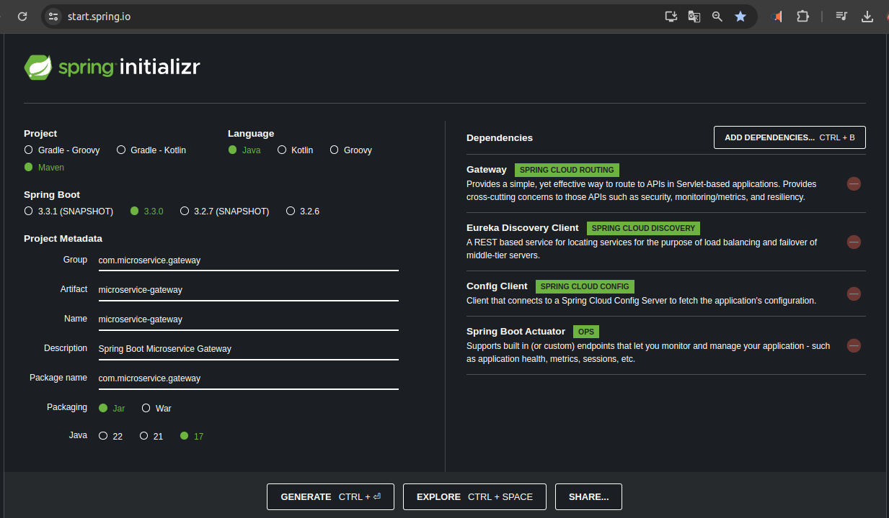

### 3. Descargar la solución, descomprimir y pegar la carpeta resultante en la carpeta raíz del proyecto padre

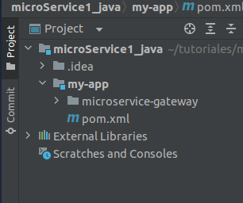

### 4. Modificar el `pom.xml` del Gateway

- Del `pom.xml` del proyecto padre, copiar las siguientes líneas y pegarlas en el `pom.xml` del Gateway, reemplazando todo el contenido de la etiqueta `<parent>`:

```xml
<parent>
    <groupId>com.mycompany.app</groupId>
    <artifactId>my-app</artifactId>
    <version>1.0-SNAPSHOT</version>
</parent>
```

### 5. Agregar el proyecto hijo como módulo en el `pom.xml` del padre

- Agregar la siguiente línea por encima de la etiqueta `<properties>`:

```sh
<modules>
  <module>microservice-gateway</module>
</modules>
```

Recarga Maven para confirmar y actualizar las modificaciones. La siguiente imagen muestra claramente que el proyecto ha sido anexado exitosamente al árbol de archivos del IDE.

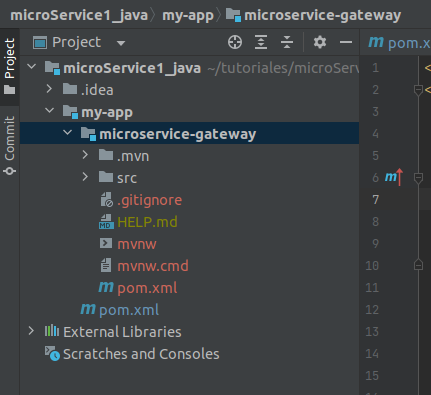

---

## Crear el Segundo Microservicio: Eureka

### 1. Ir a Spring Initializr

URL: [Spring Initializr](https://start.spring.io/)

### 2. Utilizar Maven, Java 17. Luego cambiar los nombres del nuevo proyecto y agregar las dependencias:

- Eureka Server: `SPRING CLOUD DISCOVERY`
- Config Client: `SPRING CLOUD CONFIG`
- Spring Boot Actuator: `OPS`

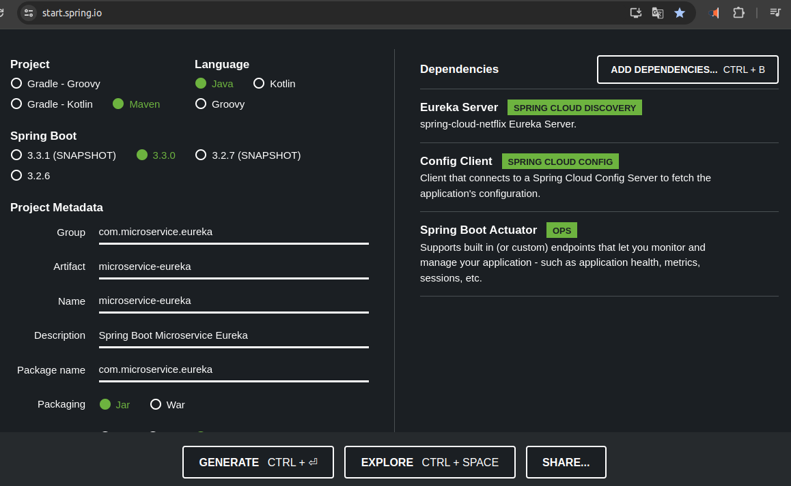

### 3. Descargar la solución, descomprimir y pegar la carpeta resultante en la carpeta raíz del proyecto padre

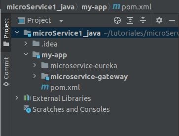

### 4. Modificar el `pom.xml` del Eureka

- Del `pom.xml` del proyecto padre, copiar las siguientes líneas y pegarlas en el `pom.xml` del Eureka, reemplazando todo el contenido de la etiqueta `<parent>`:

```sh
  <groupId>com.mycompany.app</groupId>
  <artifactId>my-app</artifactId>
  <version>1.0-SNAPSHOT</version>
```

### 5. Agregar el proyecto hijo como módulo en el `pom.xml` del padre

- Agregar la siguiente línea por encima de la etiqueta `<properties>`:

```sh
  <modules>
    <module>microservice-eureka</module>
  </modules>
```

Recarga Maven para confirmar y actualizar las modificaciones. La siguiente imagen muestra claramente que el proyecto ha sido anexado exitosamente al árbol de archivos del IDE.

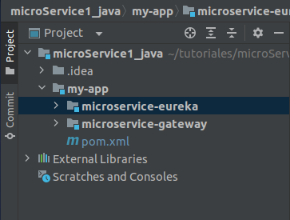

---

## Crear el Microservicio de ConfigServer

### 1. Ir a Spring Initializr

URL: [Spring Initializr](https://start.spring.io/)

### 2. Utilizar Maven, Java 17. Luego cambiar los nombres del nuevo proyecto y agregar las dependencias:

- Config Server: `SPRING CLOUD CONFIG`


### 3. Descargar la solución, descomprimir y pegar la carpeta resultante en la carpeta raíz del proyecto padre

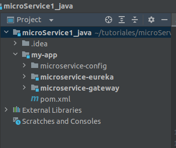

### 4. Modificar el `pom.xml` del ConfigServer

- Del `pom.xml` del proyecto padre, copiar las siguientes líneas y pegarlas en el `pom.xml` del ConfigServer, reemplazando todo el contenido de la etiqueta `<parent>`:

```sh
<groupId>com.mycompany.app</groupId>
<artifactId>my-app</artifactId>
<version>1.0-SNAPSHOT</version>
```

### 5. Agregar el proyecto hijo como módulo en el `pom.xml` del padre

- Agregar la siguiente línea por encima de la etiqueta `<properties>`:

  ```xml
  <modules>
    <module>microservice-config</module>
  </modules>
  ```

Recarga Maven para confirmar y actualizar las modificaciones. La siguiente imagen muestra claramente que el proyecto ha sido anexado

exitosamente al árbol de archivos del IDE.

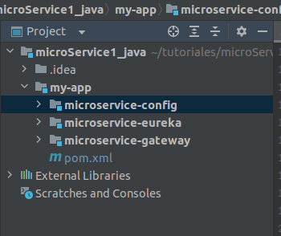

---


## Agregar Banners a los Distintos Microservicios

1. Dirígete a la siguiente URL: [DevOps Banner Generator](https://devops.datenkollektiv.de/banner.txt/index.html).
2. En "Banner Text", escribe el texto deseado y elige el tipo de salida.
3. Copia el resultado completo.
4. En el IDE, crea el archivo en la siguiente ruta: `microservice-deseado/src/main/resources/banner.txt`.
5. Pega el resultado.
6. Guarda y cierra el archivo.

---

## Configurar los Distintos Microservicios

### Microservicio de Eureka

1. Cambia el archivo de configuración del microservicio de *.properties* a *.yml*.
    - Es más común utilizar el formato *.yml* en proyectos de microservicios, aunque también se puede trabajar con *.properties*.
2. Agrega las siguientes líneas al archivo `application.yml`. Ten en cuenta las indentaciones y los espacios en blanco, ya que son importantes:

```yaml
server:
  port: 8761
spring:
  application:
    name: msvc-eureka
  config:
    import: optional:configserver:http://localhost:8888
eureka:
  instance:
    hostname: localhost
  client:
    register-with-eureka: false
    fetch-registry: false
    service-url:
      defaultZone: http://localhost:${server.port}/eureka/
```

3. En la clase principal del proyecto Eureka, agrega la anotación `@EnableEurekaServer`:

```java
@EnableEurekaServer
@SpringBootApplication
public class MicroserviceEurekaApplication {
    public static void main(String[] args) {
        SpringApplication.run(MicroserviceEurekaApplication.class, args);
    }
}
```

4. Una vez hecho esto, puedes lanzar este microservicio y en el navegador ir a la siguiente URL:

```sh
http://localhost:8761
```

El puerto 8761 es el que configuramos en el archivo `application.yml`. En el navegador se mostrará el siguiente HTML:
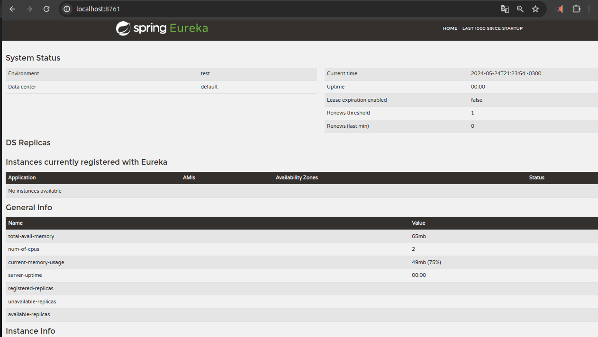

---

## Microservicio de Estudiantes

1. Inicia el proyecto en Spring Initializr.
    - Dependencias utilizadas:
        - Spring Web (WEB)
        - Spring Data JPA (SQL)
        - MySQL Driver (SQL)
        - Config Client (SPRING CLOUD CONFIG)
        - Eureka Discovery Client (SPRING CLOUD DISCOVERY)
        - Spring Boot Actuator (OPS)


2. Crea el banner y guárdalo en `src/main/resources/banner.txt`.
3. Renombra el archivo `application.properties` a `application.yml` y agrega las siguientes configuraciones:

```yaml
server:
  port: 8090
spring:
  application:
    name: microservice-student
  datasource:
    driver-class-name: com.mysql.cj.jdbc.Driver
    url: jdbc:mysql://localhost:3306/studentdb
    username: ${MYSQL_USER}
    password: ${MYSQL_PASSWORD}
  jpa:
    hibernate:
      ddl-auto: create
    database: mysql
    database-platform: org.hibernate.dialect.MySQL8Dialect
  config:
    import: optional:configserver:http://localhost:8888
eureka:
  instance:
    hostname: localhost
  client:
    service-url:
      defaultZone: http://localhost:8761/eureka
```

4. Reemplaza las siguientes líneas en el archivo `pom.xml` del microservicio de estudiantes para que reconozca al proyecto principal como su padre:

```xml
<parent>
    <groupId>com.mycompany.app</groupId>
    <artifactId>my-app</artifactId>
    <version>1.0-SNAPSHOT</version>
</parent>
```

5. En el `pom.xml` del proyecto padre, agrega el nuevo módulo:

```xml
<modules>
  <module>microservice-student</module>
</modules>
```

6. En la clase principal del microservicio de estudiantes, puedes agregar la anotación `@EnableDiscoveryClient` (opcional):

```java
// import ......
@EnableDiscoveryClient // <= línea agregada
@SpringBootApplication
public class MicroserviceStudentApplication {
    public static void main(String[] args) {
        SpringApplication.run(MicroserviceStudentApplication.class, args);
    }
}
```

7. Crea la base de datos `studentdb` en MySQL.
8. Luego, puedes ejecutar primero el servicio de Eureka y luego el de estudiantes.
9. En el navegador, ve a `http://localhost:8761/` para verificar que el servicio de estudiantes se ha registrado correctamente en Eureka.

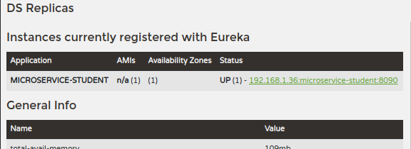

Es importante recalcar que primero se debe ejecutar el servicio de Eureka y luego el resto de los servicios.

Claro, continuemos mejorando y detallando la documentación:

---

## Microservicio de Curso

### Generar el Proyecto

Desde [Spring Initializr](https://start.spring.io/), genera el proyecto **microservice-course** con las siguientes dependencias:

- Spring Web
- Spring Data JPA
- Config Client (Spring Cloud Config)
- Eureka Discovery Client (Spring Cloud Discovery)
- Spring Boot Actuator
- PostgreSQL Driver SQL

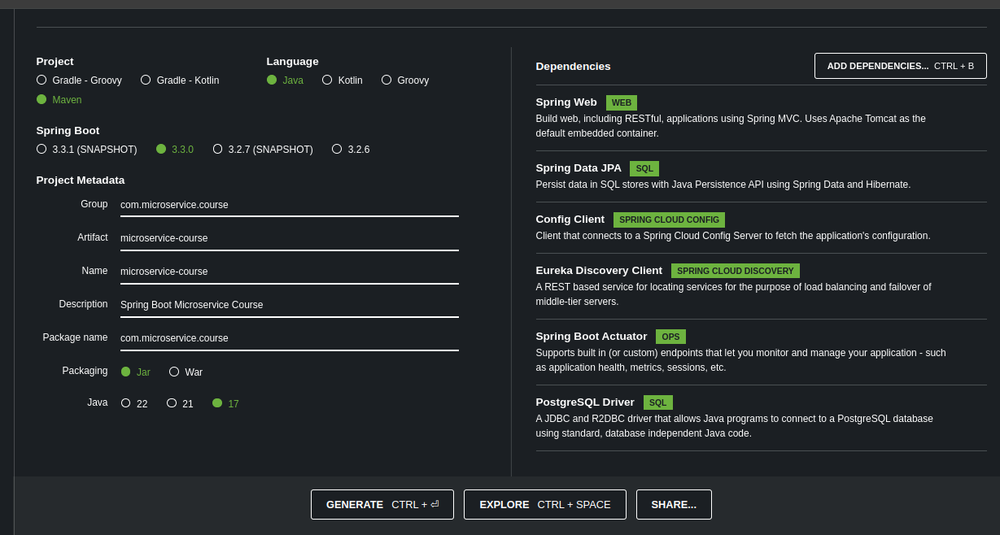

Descarga, descomprime y coloca la carpeta correspondiente en la raíz del proyecto principal.

### Configuración del POM

En el archivo `pom.xml` del proyecto **curso**, asegúrate de que la etiqueta `<parent>` contenga las líneas que corresponden al proyecto padre. Además, en el proyecto padre, agrega el nuevo módulo con el nombre del hijo.

#### Ejemplo de configuración del POM:

```xml
<parent>
  <groupId>com.mycompany.app</groupId>
  <artifactId>my-app</artifactId>
  <version>1.0-SNAPSHOT</version>
</parent>
```

### Configuración del archivo `.yml`

Renombra el archivo `.properties` a `.yml` y agrega las siguientes configuraciones:

```yaml
server:
  port: 9090

spring:
  application:
    name: msvc_course
  datasource:
    driver-class-name: org.postgresql.Driver
    url: jdbc:postgresql://localhost:5432/cursobd
    username: ${POSTGRE_USER}
    password: ${POSTGRE_PASSWORD}
  jpa:
    hibernate:
      ddl-auto: create
    database: postgresql
    database-platform: org.hibernate.dialect.PostgreSQLDialect
  config:
    import: optional:configserver:http://localhost:8888

eureka:
  instance:
    hostname: localhost
  client:
    service-url:
      defaultZone: http://localhost:8761/eureka
```

### Habilitar Discovery Client

En el main del servicio de Curso, agrega la anotación `@EnableDiscoveryClient`.

### Verificar el Servicio

Ejecuta el servicio de Curso y verifica que esté anexado al servidor de Eureka.

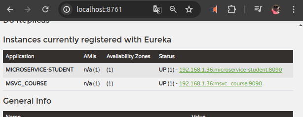

---

## Crear Paquetes y Clases del Microservicio de Curso

### Paquete Entity

- Clase `Course`
    - Atributos privados: `id`, `name`, `teacher`

### Paquete Repository

- Interface `CourseRepository`
    - Extiende de `CrudRepository<Course, Long>`
    - Anotación: `@Repository`

### Paquete Service

- Interface `ICourseService`
    - Firmas de métodos necesarios

- Clase `CourseServiceImpl`
    - Implementa `ICourseService`
    - Anotación: `@Service`
    - Inyección de dependencia del repositorio

### Paquete Controller

- Clase `CourseController`
    - Anotaciones: `@RestController`, `@RequestMapping`
    - Inyección de dependencia de la implementación de `ICourseService` con `@Autowired`

## Comunicación entre Microservicios

### Dependencia para OpenFeign

Agrega la siguiente dependencia en el POM del proyecto de Curso para la comunicación entre microservicios a través de consultas HTTP:

```xml
<dependency>
  <groupId>org.springframework.cloud</groupId>
  <artifactId>spring-cloud-starter-openfeign</artifactId>
</dependency>
```

### Crear Paquete y Clase DTO

- Paquete `dto`
    - Clase `StudentDTO`

```java
package com.microservice.dto;

@Data
@Builder
@AllArgsConstructor
@NoArgsConstructor
public class StudentDTO {
    private String name;
    private String lastName;
    private String email;
    private Long courseId;
}
```

### Crear Paquete Cliente

- Paquete `client`
    - Clase `StudentClient`

```java
package com.microservice.client;

import org.springframework.cloud.openfeign.FeignClient;
import org.springframework.web.bind.annotation.GetMapping;
import org.springframework.web.bind.annotation.PathVariable;
import java.util.List;

@FeignClient(name = "microservice-student", url = "localhost:8090/api/student")
public interface StudentClient {
    @GetMapping("/search-by-course/{idCourse}")
    List<StudentDTO> findAllStudentByCourse(@PathVariable Long idCourse);
}
```

**Explicación:**
El cliente Feign (`StudentClient`) facilita la comunicación con el microservicio de estudiantes mediante consultas HTTP. La anotación `@FeignClient` indica el nombre y la URL del servicio al que se realizará la solicitud.

### Crear Paquete HTTP

- Paquete `http`
    - Subpaquete `response`
        - Clase `StudentByCourseResponse`

```java
package com.microservice.http.response;

@Data
@Builder
@AllArgsConstructor
@NoArgsConstructor
public class StudentByCourseResponse {
    private String courseName;
    private String teacher;
    private List<StudentDTO> studentDTOList;
}
```

### Modificación en ICourseService

Agrega la siguiente firma en `ICourseService`:

```java
StudentByCourseResponse findStudentByIdCourse(Long idCourse);
```

### Implementación en CourseServiceImpl

```java
@Autowired
private StudentClient studentClient;

@Override
public StudentByCourseResponse findStudentByIdCourse(Long idCourse) {
    Course course = courseRepository.findById(idCourse).orElse(new Course());
    List<StudentDTO> studentDTOList = studentClient.findAllStudentByCourse(idCourse);
    return StudentByCourseResponse.builder()
            .courseName(course.getName())
            .teacher(course.getTeacher())
            .studentDTOList(studentDTOList)
            .build();
}
```

### Modificación en CourseController

Crea un nuevo endpoint en `CourseController`:

```java
@GetMapping("/search-student/{idCourse}")
public ResponseEntity<?> findStudentByIdCourse(@PathVariable Long idCourse) {
    return ResponseEntity.ok(courseService.findStudentByIdCourse(idCourse));
}
```

### Habilitar Feign Clients

En el main de Course, agrega la anotación `@EnableFeignClients`.

---


Claro, aquí tienes una versión mejorada y más explicativa de la documentación para el microservicio de Gateway:

---

## Microservicio de Gateway

El microservicio de Gateway actúa como un punto de entrada para todas las solicitudes dirigidas a otros microservicios. Esto permite centralizar y simplificar la administración de las rutas y la comunicación entre los microservicios.

### Configuración del Gateway

#### Habilitar Feign Clients

En el main del microservicio de Gateway, agrega la anotación `@EnableFeignClients`. Esta anotación habilita la funcionalidad de Feign para permitir la comunicación entre microservicios a través de clientes HTTP declarativos.

```java
@SpringBootApplication
@EnableFeignClients
public class GatewayApplication {
    public static void main(String[] args) {
        SpringApplication.run(GatewayApplication.class, args);
    }
}
```

#### Crear el Banner

Puedes crear un banner personalizado para el microservicio de Gateway. Un banner es simplemente un mensaje ASCII que se muestra cuando la aplicación se inicia. Puedes generar uno en [patorjk.com](http://patorjk.com/software/taag) o cualquier generador de arte ASCII.

#### Configuración del Archivo `.yml`

Renombra el archivo de propiedades a `application.yml` y agrega las siguientes configuraciones:

```yml
eureka:
  client:
    register-with-eureka: false

server:
  port: 8080

spring:
  application:
    name: msvc-gateway
  cloud:
    gateway:
      discovery:
        locator:
          enabled: true
      routes:
        - id: students
          uri: http://localhost:8090
          predicates:
            - Path=/api/student/**
        - id: courses
          uri: http://localhost:9090
          predicates:
            - Path=/api/course/**
  config:
    import: optional:configserver:http://localhost:8888
```

**Explicación de la configuración:**

- **Eureka Client:**
    - `register-with-eureka: false` indica que este servicio no se registrará en el servidor Eureka. El Gateway utilizará el descubrimiento de servicios pero no necesita estar registrado.

- **Servidor:**
    - `port: 8080` especifica el puerto en el que el Gateway estará escuchando las solicitudes.

- **Aplicación:**
    - `name: msvc-gateway` define el nombre del microservicio.

- **Spring Cloud Gateway:**
    - `discovery.locator.enabled: true` habilita la localización de servicios a través de Eureka.
    - `routes`: Define las rutas que el Gateway manejará.
        - `id: students`: Identificador para la ruta de estudiantes.
        - `predicates`: Define los patrones de URL que se dirigirán a esta ruta.

#### Actualización del Cliente Feign en el Microservicio de Curso

Debido a la introducción del Gateway, es necesario actualizar la URL de las peticiones en el cliente Feign del microservicio de curso para que apunten al Gateway en lugar de directamente al microservicio de estudiantes.

Modifica la interfaz `StudentClient` en el microservicio de curso:

```java
package com.microservice.client;

import org.springframework.cloud.openfeign.FeignClient;
import org.springframework.web.bind.annotation.GetMapping;
import org.springframework.web.bind.annotation.PathVariable;
import java.util.List;

@FeignClient(name = "msvc-gateway", url = "localhost:8080/api/student")
public interface StudentClient {
    @GetMapping("/search-by-course/{idCourse}")
    List<StudentDTO> findAllStudentByCourse(@PathVariable Long idCourse);
}
```

**Explicación:**
- **@FeignClient(name = "msvc-gateway", url = "localhost:8080/api/student")**:
    - `name`: Define el nombre del cliente Feign.
    - `url`: Indica la URL base que utilizará este cliente para hacer las peticiones. En este caso, apunta al Gateway que está en el puerto 8080.

Con esta configuración, cualquier solicitud para obtener estudiantes por curso será dirigida al Gateway, el cual a su vez redirigirá la solicitud al microservicio de estudiantes.

---
### Microservicio de Configuración (Config Service)

El microservicio de configuración se encarga de centralizar y gestionar las configuraciones de todos los microservicios en el sistema. Esto permite un manejo más eficiente y centralizado de las configuraciones.

#### Pasos para Configurar el Microservicio de Configuración

1. **Anotación `@EnableFeignClients` en el Main**
    - En la clase principal del Config Service, asegúrate de agregar la anotación `@EnableFeignClients` para habilitar Feign Clients.

   ```java
   @SpringBootApplication
   @EnableConfigServer
   public class ConfigServiceApplication {
       public static void main(String[] args) {
           SpringApplication.run(ConfigServiceApplication.class, args);
       }
   }
   ```

2. **Crear el Banner**
    - Puedes personalizar el banner del microservicio de configuración agregando un archivo `banner.txt` en el directorio `src/main/resources`.

3. **Modificar el Archivo `application.properties` a `application.yml`**
    - Renombra el archivo `application.properties` a `application.yml` y configura el servidor de configuración como se muestra a continuación:

   ```yaml
   server:
     port: 8888

   spring:
     profiles:
       active: native
     application:
       name: config-server
     cloud:
       config:
         server:
           native:
             search-locations: classpath:/configuration
   ```

4. **Crear el Directorio de Configuración**
    - Crea un nuevo directorio en `src/main/resources` llamado `configuration`. Aquí es donde se almacenarán las configuraciones específicas de cada microservicio.

5. **Crear Archivos de Configuración para Cada Microservicio**
    - Dentro del directorio `configuration`, crea un archivo `.yml` para cada microservicio. Por ejemplo, para manejar las configuraciones del microservicio de estudiantes, crea un archivo llamado `msvc-student.yml` con las siguientes configuraciones:

   ```yaml
   server:
     port: 8090
   spring:
     application:
       name: msvc-student
     datasource:
       driver-class-name: com.mysql.cj.jdbc.Driver
       url: jdbc:mysql://localhost:3306/studentdb
       username: ${MYSQL_USER}
       password: ${MYSQL_PASSWORD}
     jpa:
       hibernate:
         ddl-auto: create
       database: mysql
       database-platform: org.hibernate.dialect.MySQL8Dialect
   eureka:
     instance:
       hostname: localhost
     client:
       service-url:
         defaultZone: http://localhost:8761/eureka
   ```

6. **Configurar el Archivo `application.yml` del Microservicio de Estudiantes**
    - En el microservicio de estudiantes, configura el archivo `application.yml` para que importe las configuraciones del servidor de configuración:

   ```yaml
   spring:
     application:
       name: msvc-student

     config:
       import: optional:configserver:http://localhost:8888
   ```

7. **Repetir el Proceso para Otros Microservicios**
    - Realiza los mismos pasos para los microservicios de `course`, `student`, `eureka`, y `gateway`.

#### Ejemplo de Configuración para el Microservicio de Gateway
Para el caso del microservice de Gateway y a modo de ejemplo haremos las configuración necesarias para que no se registre en el servidor de eureka.

- **Archivo `msvc-gateway.yml` en el Directorio de Configuración:**

  ```yaml
  server:
    port: 8080

  spring:
    application:
      name: msvc-gateway
   # Otras configuraciones ..... 
  eureka:
    client:
      register-with-eureka: false
  ```

- **Explicación de la Configuración del Gateway:**
    - La configuración `eureka.client.register-with-eureka` está configurada en `false` para evitar que el Gateway se registre en Eureka.

