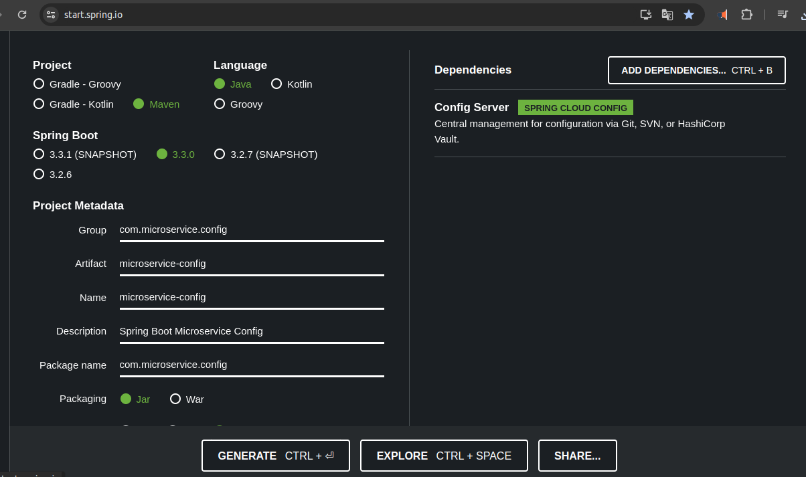
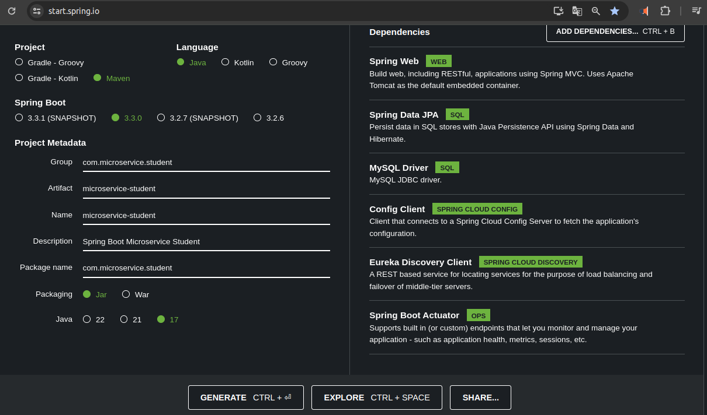

### Inicio


## Iniciar Proyecto Padre

### 1. Crear carpeta contenedora

### 2. Ir a Maven en el navegador y buscar "Maven in 5 minutes"

URL: [Maven in 5 minutes](https://maven.apache.org/guides/getting-started/maven-in-five-minutes.html)

### 3. Copiar el código inicializador del proyecto

```bash
mvn archetype:generate -DgroupId=com.mycompany.app -DartifactId=my-app -DarchetypeArtifactId=maven-archetype-quickstart -DarchetypeVersion=1.4 -DinteractiveMode=false
```

### 4. Ejecutar el comando en la consola

Ubícarce en la carpeta contenedora del proyecto, pegar y modificar el comando si es necesario:

```sh
-DarchetypeArtifactId=maven-archetype => nombreArtifact
```

### 5. Una vez creado el proyecto desde el IDE

- Eliminar toda la carpeta `src`
- Modificar el archivo `pom.xml`:

    - Eliminar la siguiente línea:

  ```xml
  <!-- FIXME change it to the project's website -->
  <url>http://www.example.com</url>
  ```

    - Eliminar toda la sección `dependencies` y lo que contiene la etiqueta `build`.

### 6. Modificar el archivo `pom.xml`

- Cambiar la versión de Java a 17.
  - Agregar lo siguiente en la sección `build`:

```xml
<build>
    <pluginManagement>
        <plugins>
            <plugin>
                <groupId>org.springframework.boot</groupId>
                <artifactId>spring-boot-maven-plugin</artifactId>
                <version>3.2.5</version>
            </plugin>
        </plugins>
    </pluginManagement>
</build>
```
- Agregar lo siguiente en la sección `dependencies`:

```xml
<dependencies>
    <dependency>
        <groupId>org.projectlombok</groupId>
        <artifactId>lombok</artifactId>
        <version>1.18.28</version>
    </dependency>
</dependencies>
```
- Debajo de la etiqueta `<name>my-app</name>`, agregar lo siguiente para especificar que este proyecto será un proyecto Padre:

```sh
  <packaging>pom</packaging>
```
- Para terminar de especificar que este `pom.xml` será el contenedor de los subproyectos, agrega lo siguiente debajo de la etiqueta `modelVersion` y encima de la etiqueta `groupId`:

  ```xml
  <parent>
      <groupId>org.springframework.boot</groupId>
      <artifactId>spring-boot-starter-parent</artifactId>
      <version>3.3.0</version>
  </parent>
  ```

### Versión 01 del `pom.xml` general

```sh
<?xml version="1.0" encoding="UTF-8"?>

<project xmlns="http://maven.apache.org/POM/4.0.0" xmlns:xsi="http://www.w3.org/2001/XMLSchema-instance"
  xsi:schemaLocation="http://maven.apache.org/POM/4.0.0 http://www.apache.org/xsd/maven-4.0.0.xsd">
  <modelVersion>4.0.0</modelVersion>

  <parent>
    <groupId>org.springframework.boot</groupId>
    <artifactId>spring-boot-starter-parent</artifactId>
    <version>3.3.0</version>
  </parent>

  <groupId>com.mycompany.app</groupId>
  <artifactId>my-app</artifactId>
  <version>1.0-SNAPSHOT</version>

  <name>my-app</name>
  <packaging>pom</packaging>

  <properties>
    <project.build.sourceEncoding>UTF-8</project.build.sourceEncoding>
    <maven.compiler.source>17</maven.compiler.source>
    <maven.compiler.target>17</maven.compiler.target>
  </properties>

  <dependencies>
    <dependency>
      <groupId>org.projectlombok</groupId>
      <artifactId>lombok</artifactId>
      <version>1.18.28</version>
    </dependency>
  </dependencies>

  <build>
    <pluginManagement>
      <plugins>
        <plugin>
          <groupId>org.springframework.boot</groupId>
          <artifactId>spring-boot-maven-plugin</artifactId>
          <version>3.2.5</version>
        </plugin>
      </plugins>
    </pluginManagement>
  </build>
</project>
```

---

## Configuración del Primer Microservicio: Gateway

### 1. Ir a Spring Initializr

URL: [Spring Initializr](https://start.spring.io/)

### 2. Utilizar Maven, Java 17. Luego cambiar los nombres del nuevo proyecto y agregar las dependencias:

- Gateway: `SPRING CLOUD ROUTING`
- Eureka Discovery Client: `SPRING CLOUD DISCOVERY`
- Config Client: `SPRING CLOUD CONFIG`
- Spring Boot Actuator: `OPS`


### 3. Descargar la solución, descomprimir y pegar la carpeta resultante en la carpeta raíz del proyecto padre


### 4. Modificar el `pom.xml` del Gateway

- Del `pom.xml` del proyecto padre, copiar las siguientes líneas y pegarlas en el `pom.xml` del Gateway, reemplazando todo el contenido de la etiqueta `<parent>`:

```xml
<parent>
    <groupId>com.mycompany.app</groupId>
    <artifactId>my-app</artifactId>
    <version>1.0-SNAPSHOT</version>
</parent>
```

### 5. Agregar el proyecto hijo como módulo en el `pom.xml` del padre

- Agregar la siguiente línea por encima de la etiqueta `<properties>`:

```sh
<modules>
  <module>microservice-gateway</module>
</modules>
```

Recarga Maven para confirmar y actualizar las modificaciones. La siguiente imagen muestra claramente que el proyecto ha sido anexado exitosamente al árbol de archivos del IDE.


---

## Crear el Segundo Microservicio: Eureka

### 1. Ir a Spring Initializr

URL: [Spring Initializr](https://start.spring.io/)

### 2. Utilizar Maven, Java 17. Luego cambiar los nombres del nuevo proyecto y agregar las dependencias:

- Eureka Server: `SPRING CLOUD DISCOVERY`
- Config Client: `SPRING CLOUD CONFIG`
- Spring Boot Actuator: `OPS`


### 3. Descargar la solución, descomprimir y pegar la carpeta resultante en la carpeta raíz del proyecto padre


### 4. Modificar el `pom.xml` del Eureka

- Del `pom.xml` del proyecto padre, copiar las siguientes líneas y pegarlas en el `pom.xml` del Eureka, reemplazando todo el contenido de la etiqueta `<parent>`:

```sh
  <groupId>com.mycompany.app</groupId>
  <artifactId>my-app</artifactId>
  <version>1.0-SNAPSHOT</version>
```

### 5. Agregar el proyecto hijo como módulo en el `pom.xml` del padre

- Agregar la siguiente línea por encima de la etiqueta `<properties>`:

```sh
  <modules>
    <module>microservice-eureka</module>
  </modules>
```

Recarga Maven para confirmar y actualizar las modificaciones. La siguiente imagen muestra claramente que el proyecto ha sido anexado exitosamente al árbol de archivos del IDE.


---

## Crear el Microservicio de ConfigServer

### 1. Ir a Spring Initializr

URL: [Spring Initializr](https://start.spring.io/)

### 2. Utilizar Maven, Java 17. Luego cambiar los nombres del nuevo proyecto y agregar las dependencias:

- Config Server: `SPRING CLOUD CONFIG`



### 3. Descargar la solución, descomprimir y pegar la carpeta resultante en la carpeta raíz del proyecto padre


### 4. Modificar el `pom.xml` del ConfigServer

- Del `pom.xml` del proyecto padre, copiar las siguientes líneas y pegarlas en el `pom.xml` del ConfigServer, reemplazando todo el contenido de la etiqueta `<parent>`:

```sh
<groupId>com.mycompany.app</groupId>
<artifactId>my-app</artifactId>
<version>1.0-SNAPSHOT</version>
```

### 5. Agregar el proyecto hijo como módulo en el `pom.xml` del padre

- Agregar la siguiente línea por encima de la etiqueta `<properties>`:

  ```xml
  <modules>
    <module>microservice-config</module>
  </modules>
  ```

Recarga Maven para confirmar y actualizar las modificaciones. La siguiente imagen muestra claramente que el proyecto ha sido anexado

exitosamente al árbol de archivos del IDE.


---


## Agregar Banners a los Distintos Microservicios

1. Dirígete a la siguiente URL: [DevOps Banner Generator](https://devops.datenkollektiv.de/banner.txt/index.html).
2. En "Banner Text", escribe el texto deseado y elige el tipo de salida.
3. Copia el resultado completo.
4. En el IDE, crea el archivo en la siguiente ruta: `microservice-deseado/src/main/resources/banner.txt`.
5. Pega el resultado.
6. Guarda y cierra el archivo.

---

## Configurar los Distintos Microservicios

### Microservicio de Eureka

1. Cambia el archivo de configuración del microservicio de *.properties* a *.yml*.
    - Es más común utilizar el formato *.yml* en proyectos de microservicios, aunque también se puede trabajar con *.properties*.
2. Agrega las siguientes líneas al archivo `application.yml`. Ten en cuenta las indentaciones y los espacios en blanco, ya que son importantes:

```yaml
server:
  port: 8761
spring:
  application:
    name: msvc-eureka
  config:
    import: optional:configserver:http://localhost:8888
eureka:
  instance:
    hostname: localhost
  client:
    register-with-eureka: false
    fetch-registry: false
    service-url:
      defaultZone: http://localhost:${server.port}/eureka/
```

3. En la clase principal del proyecto Eureka, agrega la anotación `@EnableEurekaServer`:

```java
@EnableEurekaServer
@SpringBootApplication
public class MicroserviceEurekaApplication {
    public static void main(String[] args) {
        SpringApplication.run(MicroserviceEurekaApplication.class, args);
    }
}
```

4. Una vez hecho esto, puedes lanzar este microservicio y en el navegador ir a la siguiente URL:

```sh
http://localhost:8761
```

El puerto 8761 es el que configuramos en el archivo `application.yml`. En el navegador se mostrará el siguiente HTML:


---

## Microservicio de Estudiantes

1. Inicia el proyecto en Spring Initializr.
    - Dependencias utilizadas:
        - Spring Web (WEB)
        - Spring Data JPA (SQL)
        - MySQL Driver (SQL)
        - Config Client (SPRING CLOUD CONFIG)
        - Eureka Discovery Client (SPRING CLOUD DISCOVERY)
        - Spring Boot Actuator (OPS)



2. Crea el banner y guárdalo en `src/main/resources/banner.txt`.
3. Renombra el archivo `application.properties` a `application.yml` y agrega las siguientes configuraciones:

```yaml
server:
  port: 8090
spring:
  application:
    name: microservice-student
  datasource:
    driver-class-name: com.mysql.cj.jdbc.Driver
    url: jdbc:mysql://localhost:3306/studentdb
    username: ${MYSQL_USER}
    password: ${MYSQL_PASSWORD}
  jpa:
    hibernate:
      ddl-auto: create
    database: mysql
    database-platform: org.hibernate.dialect.MySQL8Dialect
  config:
    import: optional:configserver:http://localhost:8888
eureka:
  instance:
    hostname: localhost
  client:
    service-url:
      defaultZone: http://localhost:8761/eureka
```

4. Reemplaza las siguientes líneas en el archivo `pom.xml` del microservicio de estudiantes para que reconozca al proyecto principal como su padre:

```xml
<parent>
    <groupId>com.mycompany.app</groupId>
    <artifactId>my-app</artifactId>
    <version>1.0-SNAPSHOT</version>
</parent>
```

5. En el `pom.xml` del proyecto padre, agrega el nuevo módulo:

```xml
<modules>
  <module>microservice-student</module>
</modules>
```

6. En la clase principal del microservicio de estudiantes, puedes agregar la anotación `@EnableDiscoveryClient` (opcional):

```java
// import ......
@EnableDiscoveryClient // <= línea agregada
@SpringBootApplication
public class MicroserviceStudentApplication {
    public static void main(String[] args) {
        SpringApplication.run(MicroserviceStudentApplication.class, args);
    }
}
```

7. Crea la base de datos `studentdb` en MySQL.
8. Luego, puedes ejecutar primero el servicio de Eureka y luego el de estudiantes.
9. En el navegador, ve a `http://localhost:8761/` para verificar que el servicio de estudiantes se ha registrado correctamente en Eureka.


Es importante recalcar que primero se debe ejecutar el servicio de Eureka y luego el resto de los servicios.

Claro, continuemos mejorando y detallando la documentación:

---

## Microservicio Curso

Desde [Spring Initializr](https://start.spring.io/) genera el proyecto `microservice-course` con las siguientes dependencias:

- Spring Web (WEB)
- Spring Data JPA (SQL)
- Config Client (SPRING CLOUD CONFIG)
- Eureka Discovery Client (SPRING CLOUD DISCOVERY)
- Spring Boot Actuator (OPS)
- PostgreSQL Driver (SQL)


1. Genera el proyecto, descárgalo, descomprímelo y pega la carpeta correspondiente en la raíz del proyecto principal.
2. Modifica el `pom.xml` del proyecto `microservice-course` para que en la etiqueta `<parent></parent>` contenga las líneas que corresponden al proyecto padre.
3. En el proyecto padre, agrega el nuevo módulo con el nombre del microservicio hijo.
4. Genera el banner del nuevo microservicio y guárdalo en `src/main/resources/banner.txt`.
5. Renombra el archivo `application.properties` a `application.yml` y agrega las siguientes configuraciones:

```yaml
server:
  port: 9090
spring:
  application:
    name: msvc_course
  datasource:
    driver-class-name: org.postgresql.Driver
    url: jdbc:postgresql://${_HOST}:5432/cursobd
    username: ${POSTGRE_USER}
    password: ${POSTGRE_PASSWORD}
  jpa:
    hibernate:
      ddl-auto: create
    database: postgresql
    database-platform: org.hibernate.dialect.PostgreSQLDialect
  config:
    import: optional:configserver:http://${_HOST}:8888
eureka:
  instance:
    hostname: ${_HOST}
  client:
    service-url:
      defaultZone: http://${_HOST}:8761/eureka
```

6. Agrega la anotación `@EnableDiscoveryClient` en el `main` del servicio de Curso:

```java
@EnableDiscoveryClient
@SpringBootApplication
public class MicroserviceCourseApplication {
    public static void main(String[] args) {
        SpringApplication.run(MicroserviceCourseApplication.class, args);
    }
}
```

7. Prueba y verifica si el nuevo servicio se anexa correctamente al servidor de Eureka.


---

## Crear Paquetes y Clases del Microservicio de Estudiantes

1. **Paquete `entity`**:
    - Clase `Student` con la implementación de Lombok para sus anotaciones.
        - Atributos privados: `id`, `nombre`, `apellido`, `email` y la clave foránea `curso_id`.

2. **Paquete `repository`**:
    - Interfaz `StudentRepository` que extenderá de `CrudRepository<Student, Long>`, con la anotación `@Repository`.
        - Agregar el método de búsqueda de estudiantes por curso.

3. **Paquete `service`**:
    - Interfaz `IStudentService` que contendrá solo las firmas de los métodos necesarios.
    - Clase `StudentServiceImpl` que implementará `IStudentService`, también tendrá la anotación `@Service` y la inyección de dependencia del repositorio y el desarrollo de los métodos implementados.

4. **Paquete `controller`**:
    - Clase `StudentController` con las anotaciones `@RestController` y `@RequestMapping`. Además, se le inyectará la dependencia de la implementación de `IStudentService` con su respectiva anotación `@Autowired`, y el desarrollo de los distintos endpoints necesarios para nuestro proyecto.

## Crear Paquetes y Clases del Microservicio de Curso

1. **Paquete `entity`**:
    - Clase `Course` con los siguientes atributos: `id`, `name`, `teacher`.

### Modificaciones en `Course`

1. Agrega una nueva dependencia en el `pom.xml` del microservicio de curso para la comunicación entre microservicios mediante consultas HTTP:

```xml
<dependency>
    <groupId>org.springframework.cloud</groupId>
    <artifactId>spring-cloud-starter-openfeign</artifactId>
</dependency>
```

2. **Paquete `dto`**:
    - Clase `StudentDTO` para la manipulación del objeto de transferencia:

```java
package com.microservice.dto;

import lombok.Data;
import lombok.AllArgsConstructor;
import lombok.NoArgsConstructor;
import lombok.Builder;

@Data
@Builder
@AllArgsConstructor
@NoArgsConstructor
public class StudentDTO {
    private String name;
    private String lastName;
    private String email;
    private Long courseId;
}
```

3. **Paquete `client`**:
    - Clase `StudentClient` con la anotación `@FeignClient(name ="microservice-student")`. El valor de `name` es el que escribimos en el `application.yml` de estudiantes `microservice-student`:

```java
package com.microservice.client;

import org.springframework.cloud.openfeign.FeignClient;
import org.springframework.web.bind.annotation.GetMapping;
import org.springframework.web.bind.annotation.PathVariable;
import java.util.List;

@FeignClient(name = "microservice-student", url = "localhost:8090/api/student")
public interface StudentClient {
    @GetMapping("/search-my-course/{idCourse}")
    List<StudentDTO> findAllStudentsByCourse(@PathVariable Long idCourse);
}
```
